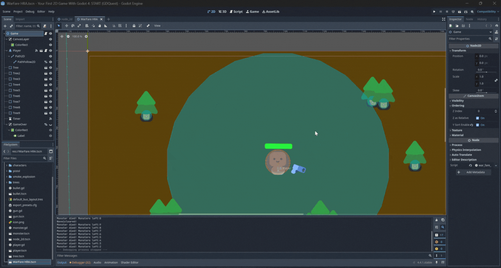

# WarfareHRA 🎮

A browser-based action game built using **GDScript** (Godot Engine), **JavaScript**, and **HTML**.

---

##  What’s In This Game
- **HTML / JS frontend** to embed and control the game.
- **Godot project files** (`.tscn`, `.gd`) with player, enemies, bullet, environment logic.
- **Sprites + assets folder** (like `icon.png`) to build the game world.

---

##  Screenshots / Demo

  

